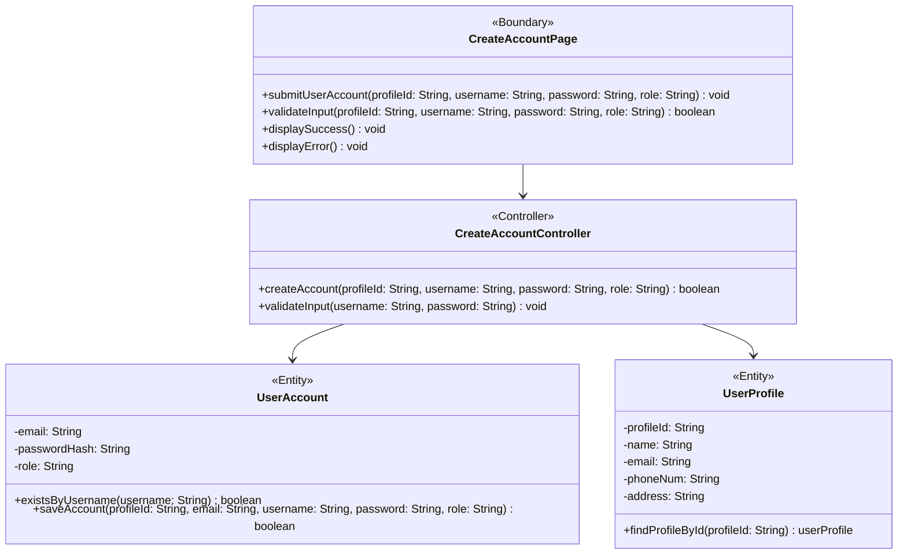

# BCE Diagram: Create User Account

## BCE Role Mapping
- Boundary: Next.js create account page component at `frontend/src/feature/CreateAccount/boundary/CreateAccountPage.tsx` that gathers input, validates user input, checks `User admin` access, and shows success or error feedback.
- Controller: TypeScript controller class at `backend/src/CreateAccount/controller/CreateAccountController.ts` that coordinates account validation, username lookup, profile lookup, and account creation.
- Entity: `UserAccount` handles username lookup and account persistence, while `UserProfile` provides profile lookup by ID.
- Database: PostgreSQL `user_account` and `user_profile` tables used by the entity layer.
- Boundary rule: No success or error message is displayed before the user admin submits the create account form.
