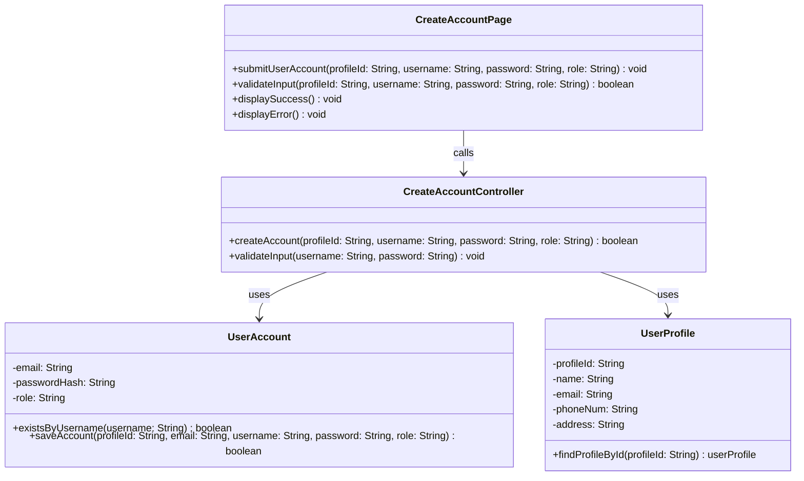

# Class Diagram: Create User Account

## Design Notes
- The supplied BCE and sequence artifacts used different controller names. The docs are normalized to `CreateAccountController` to match the implemented code.
- `UserAccount.saveAccount(...)` stores the linked profile email together with the account because `user_account.email` is `NOT NULL` in the current schema.
- `CreateAccountController.createAccount(...)` returns a result object containing `success: boolean` and `message: string` so the route and boundary can distinguish duplicate username, missing profile, and generic save failures. The `success` field serves as the `boolean` return type specified in the diagram.
- Return types in code are `Promise<T>` due to async DB operations. The underlying type still matches the diagram intent.
- `displayError()` accepts a message parameter internally to show specific validation and backend error messages, while the diagram captures the public contract.
