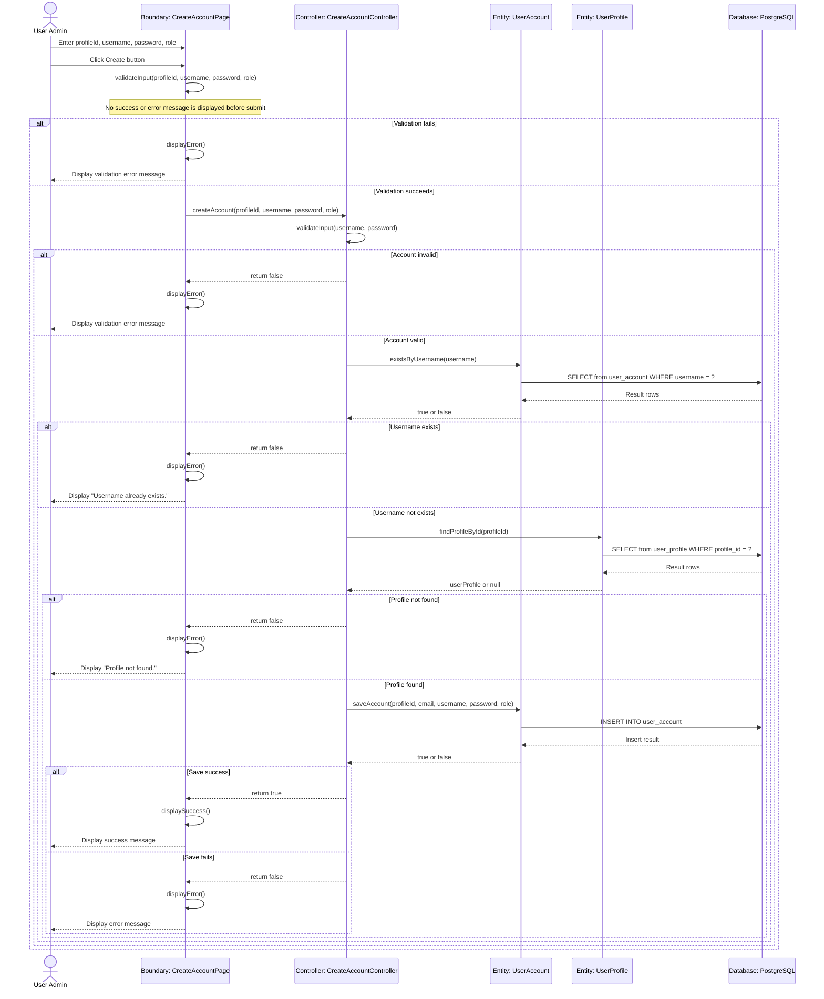

# Sequence Diagram: Create User Account

```mermaid
sequenceDiagram
    actor UserAdmin as User Admin
    participant CreateAccountPage as Boundary: CreateAccountPage
    participant CreateAccountController as Controller: CreateAccountController
    participant UserAccount as Entity: UserAccount
    participant UserProfile as Entity: UserProfile
    participant PostgreSQL as Database: PostgreSQL

    UserAdmin->>CreateAccountPage: Enter profileId, username, password, role
    UserAdmin->>CreateAccountPage: Click Create button
    CreateAccountPage->>CreateAccountPage: validateInput(profileId, username, password, role)
    Note over CreateAccountPage: No success or error message is displayed before submit

    alt Validation fails
        CreateAccountPage->>CreateAccountPage: displayError()
        CreateAccountPage-->>UserAdmin: Display validation error message
    else Validation succeeds
        CreateAccountPage->>CreateAccountController: createAccount(profileId, username, password, role)
        CreateAccountController->>CreateAccountController: validateInput(username, password)

        alt Account invalid
            CreateAccountController-->>CreateAccountPage: return false
            CreateAccountPage->>CreateAccountPage: displayError()
            CreateAccountPage-->>UserAdmin: Display validation error message
        else Account valid
            CreateAccountController->>UserAccount: existsByUsername(username)
            UserAccount->>PostgreSQL: SELECT from user_account WHERE username = ?
            PostgreSQL-->>UserAccount: Result rows
            UserAccount-->>CreateAccountController: true or false

            alt Username exists
                CreateAccountController-->>CreateAccountPage: return false
                CreateAccountPage->>CreateAccountPage: displayError()
                CreateAccountPage-->>UserAdmin: Display "Username already exists."
            else Username not exists
                CreateAccountController->>UserProfile: findProfileById(profileId)
                UserProfile->>PostgreSQL: SELECT from user_profile WHERE profile_id = ?
                PostgreSQL-->>UserProfile: Result rows
                UserProfile-->>CreateAccountController: userProfile or null

                alt Profile not found
                    CreateAccountController-->>CreateAccountPage: return false
                    CreateAccountPage->>CreateAccountPage: displayError()
                    CreateAccountPage-->>UserAdmin: Display "Profile not found."
                else Profile found
                    CreateAccountController->>UserAccount: saveAccount(profileId, email, username, password, role)
                    UserAccount->>PostgreSQL: INSERT INTO user_account
                    PostgreSQL-->>UserAccount: Insert result
                    UserAccount-->>CreateAccountController: true or false

                    alt Save success
                        CreateAccountController-->>CreateAccountPage: return true
                        CreateAccountPage->>CreateAccountPage: displaySuccess()
                        CreateAccountPage-->>UserAdmin: Display success message
                    else Save fails
                        CreateAccountController-->>CreateAccountPage: return false
                        CreateAccountPage->>CreateAccountPage: displayError()
                        CreateAccountPage-->>UserAdmin: Display error message
                    end
                end
            end
        end
    end
```
