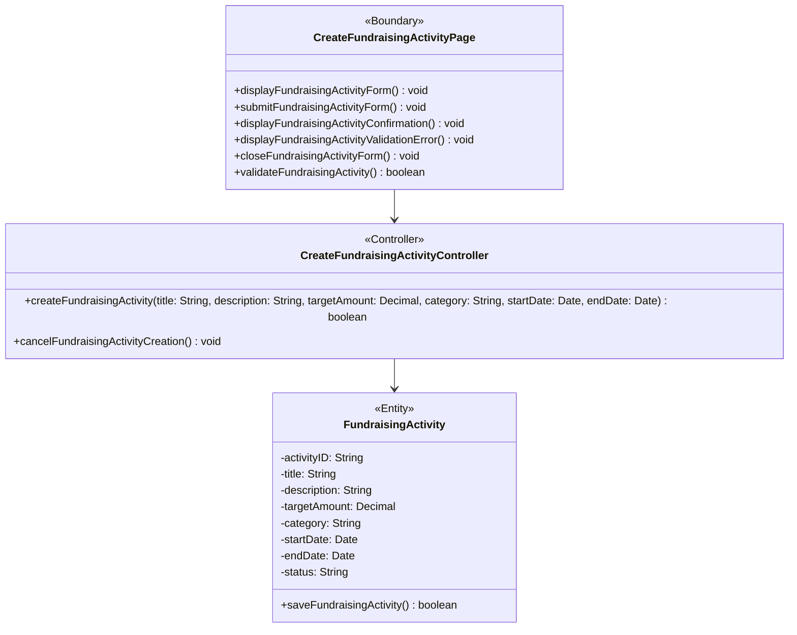

# BCE Diagram: Create Fundraising Activity

## BCE Role Mapping
- Boundary: Next.js create fundraising activity component at `frontend/src/feature/fundraising/boundary/CreateFundraisingActivityPage.tsx` that gathers form input, validates the data, displays validation feedback, displays confirmation feedback, and handles cancel navigation.
- Controller: TypeScript controller class at `backend/src/fundraising/controller/CreateFundraisingActivityController.ts` that coordinates the create activity use case and delegates persistence to the entity.
- Entity: TypeScript entity class at `backend/src/fundraising/entity/FundraisingActivity.ts` that represents persisted fundraising activity data and performs database save operations.
- Database: PostgreSQL `fundraising_activity` table used by the entity layer.

## Boundary Rules
- Validation occurs before the backend call.
- `validateFundraisingActivity(...)` returns `boolean`.
- Only a `Fundraiser` can access the create fundraising activity page in the current implementation.
