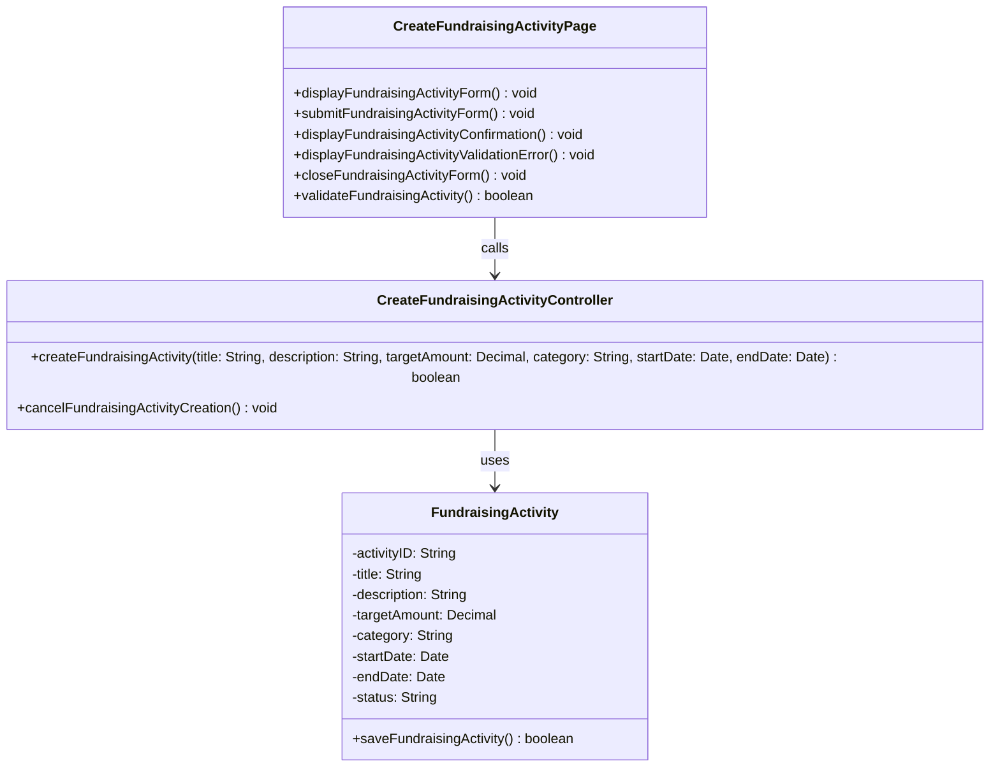

# Class Diagram: Create Fundraising Activity

## Design Notes
- The class diagram follows the approved design intent where validation responsibility stays in the boundary and `validateFundraisingActivity(...)` returns `boolean`.
- The implemented controller currently uses async TypeScript methods and returns a result object rather than a raw `boolean`. The diagram still captures the intended success or failure decision point of the create flow.
- The implemented flow is reached through `POST /api/fundraising-activity` in `backend/src/routes/fundraisingRoutes.ts`.
- `FundraisingActivity.saveFundraisingActivity(...)` is implemented as a static async entity operation that inserts into PostgreSQL and reports whether the save succeeded.
