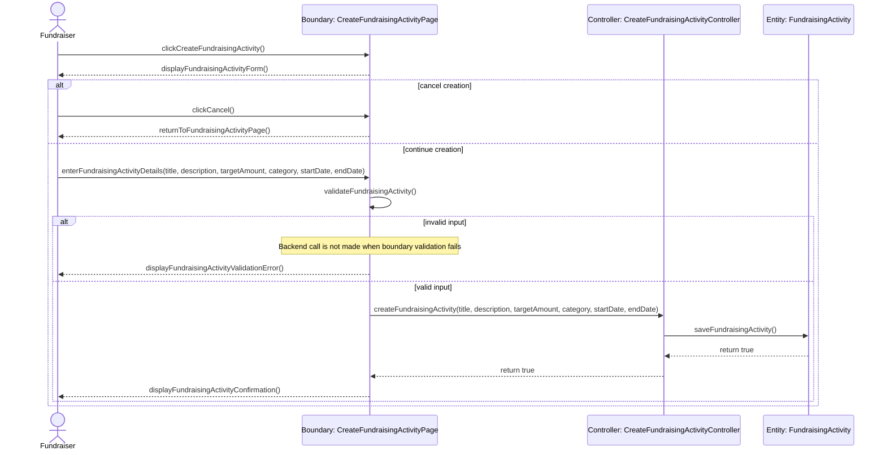

# Sequence Diagram: Create Fundraising Activity

```mermaid
sequenceDiagram
    actor Fundraiser
    participant CreateFundraisingActivityPage as Boundary: CreateFundraisingActivityPage
    participant CreateFundraisingActivityController as Controller: CreateFundraisingActivityController
    participant FundraisingActivity as Entity: FundraisingActivity

    Fundraiser->>CreateFundraisingActivityPage: clickCreateFundraisingActivity()
    CreateFundraisingActivityPage-->>Fundraiser: displayFundraisingActivityForm()

    alt cancel creation
        Fundraiser->>CreateFundraisingActivityPage: clickCancel()
        CreateFundraisingActivityPage-->>Fundraiser: returnToFundraisingActivityPage()
    else continue creation
        Fundraiser->>CreateFundraisingActivityPage: enterFundraisingActivityDetails(title, description, targetAmount, category, startDate, endDate)
        CreateFundraisingActivityPage->>CreateFundraisingActivityPage: validateFundraisingActivity()

        alt invalid input
            Note over CreateFundraisingActivityPage: Backend call is not made when boundary validation fails
            CreateFundraisingActivityPage-->>Fundraiser: displayFundraisingActivityValidationError()
        else valid input
            CreateFundraisingActivityPage->>CreateFundraisingActivityController: createFundraisingActivity(title, description, targetAmount, category, startDate, endDate)
            CreateFundraisingActivityController->>FundraisingActivity: saveFundraisingActivity()
            FundraisingActivity-->>CreateFundraisingActivityController: return true
            CreateFundraisingActivityController-->>CreateFundraisingActivityPage: return true
            CreateFundraisingActivityPage-->>Fundraiser: displayFundraisingActivityConfirmation()
        end
    end
```
