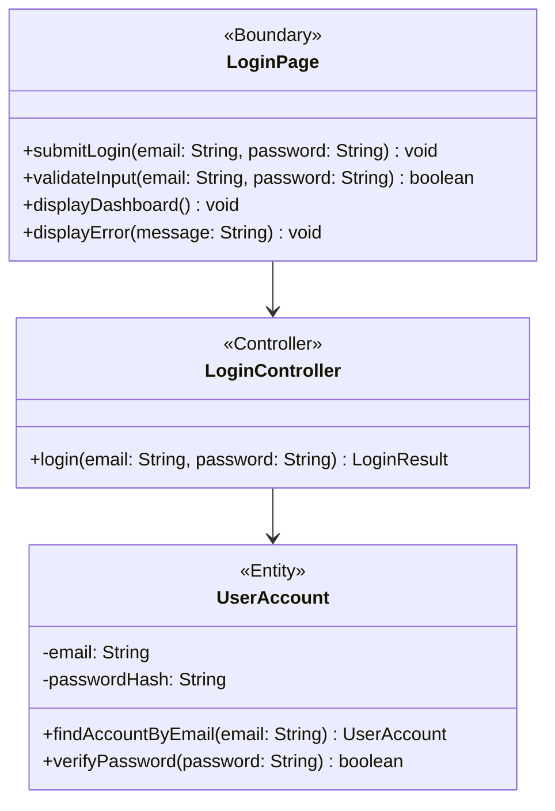

# BCE Diagram: Fundraiser Login

## BCE Role Mapping
- Boundary: Next.js login page component at `frontend/src/feature/login/boundary/LoginBoundary.tsx` that gathers input, validates user input, and shows success or error feedback.
- Controller: TypeScript login controller class at `backend/src/login/controller/LoginController.ts` that coordinates the login use case.
- Entity: TypeScript account entity class at `backend/src/login/entity/UserAccount.ts` that represents persisted account data and credential verification behavior.
- Database: PostgreSQL `user_account` table used by the entity or repository layer.
- Boundary rule: No success or error message is displayed before the fundraiser submits the login form.
