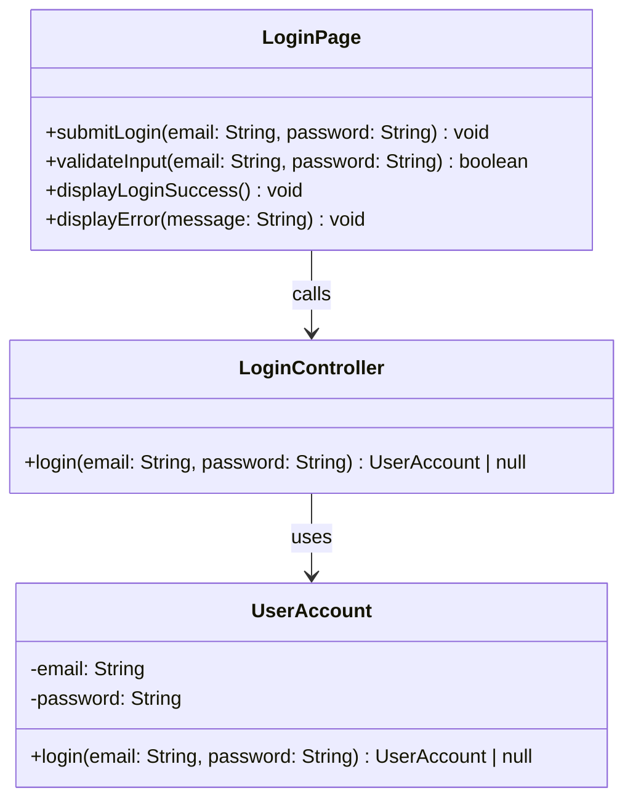

# Class Diagram: Fundraiser Login

## Design Notes
- `UserAccountRepository` has been removed. The login lookup and password check are handled by the static `UserAccount.login(email, password)` entity method, following the BCE pattern where the Entity owns all DB access via `pg` raw SQL.
- `LoginController.login(email, password)` returns `UserAccount | null`, so the boundary can branch on whether the returned account is null.
- Return types in code are `Promise<T>` due to async DB and bcrypt operations. The underlying type still matches the diagram intent.
- The implemented boundary component lives at `frontend/src/feature/login/boundary/LoginBoundary.tsx`.
