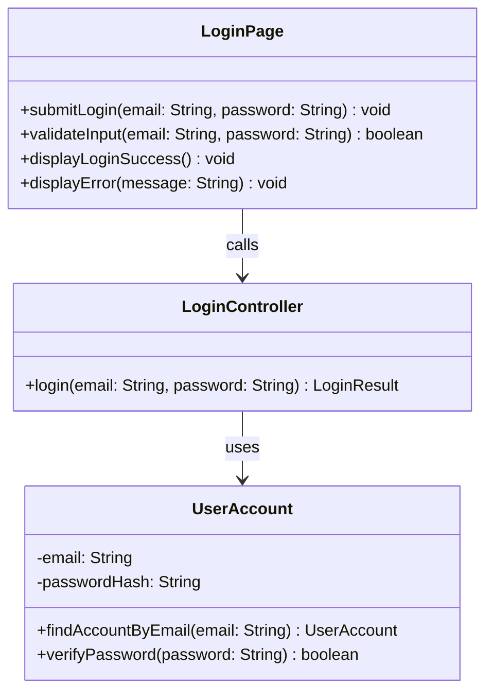

# Class Diagram: Fundraiser Login

## Design Notes
- The attribute `password` is refined to `passwordHash` because the persisted value in PostgreSQL must be a bcrypt hash, not a plain-text password.
- `UserAccountRepository` has been removed. The repository logic (`findAccountByEmail`) is a static method on the `UserAccount` entity class, following the BCE pattern where the Entity owns all DB access via `pg` raw SQL.
- `LoginController.login(email, password)` returns a distinguishable login result so the boundary can display `Account does not exist.` and `Invalid password.` exactly as required by the use case.
- Return types in code are `Promise<T>` due to async DB and bcrypt operations. The underlying type still matches the diagram intent.
- The implemented boundary component lives at `frontend/src/feature/login/boundary/LoginBoundary.tsx`.
