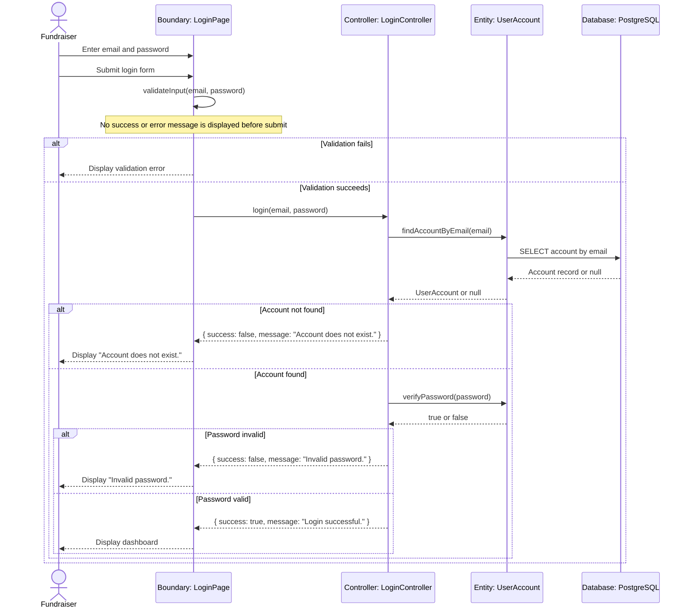

# Sequence Diagram: Fundraiser Login

```mermaid
sequenceDiagram
    actor Fundraiser
    participant LoginPage as Boundary: LoginPage
    participant LoginController as Controller: LoginController
    participant UserAccount as Entity: UserAccount
    participant PostgreSQL as Database: PostgreSQL

    Fundraiser->>LoginPage: Enter email and password
    Fundraiser->>LoginPage: Submit login form
    LoginPage->>LoginPage: validateInput(email, password)
    Note over LoginPage: No success or error message is displayed before submit

    alt Validation fails
        LoginPage-->>Fundraiser: Display validation error
    else Validation succeeds
        LoginPage->>LoginController: login(email, password)
        LoginController->>UserAccount: findAccountByEmail(email)
        UserAccount->>PostgreSQL: SELECT account by email
        PostgreSQL-->>UserAccount: Account record or null
        UserAccount-->>LoginController: UserAccount or null

        alt Account not found
            LoginController-->>LoginPage: { success: false, message: "Account does not exist." }
            LoginPage-->>Fundraiser: Display "Account does not exist."
        else Account found
            LoginController->>UserAccount: verifyPassword(password)
            UserAccount-->>LoginController: true or false

            alt Password invalid
                LoginController-->>LoginPage: { success: false, message: "Invalid password." }
                LoginPage-->>Fundraiser: Display "Invalid password."
            else Password valid
                LoginController-->>LoginPage: { success: true, message: "Login successful." }
                LoginPage-->>Fundraiser: Display dashboard
            end
        end
    end
```
