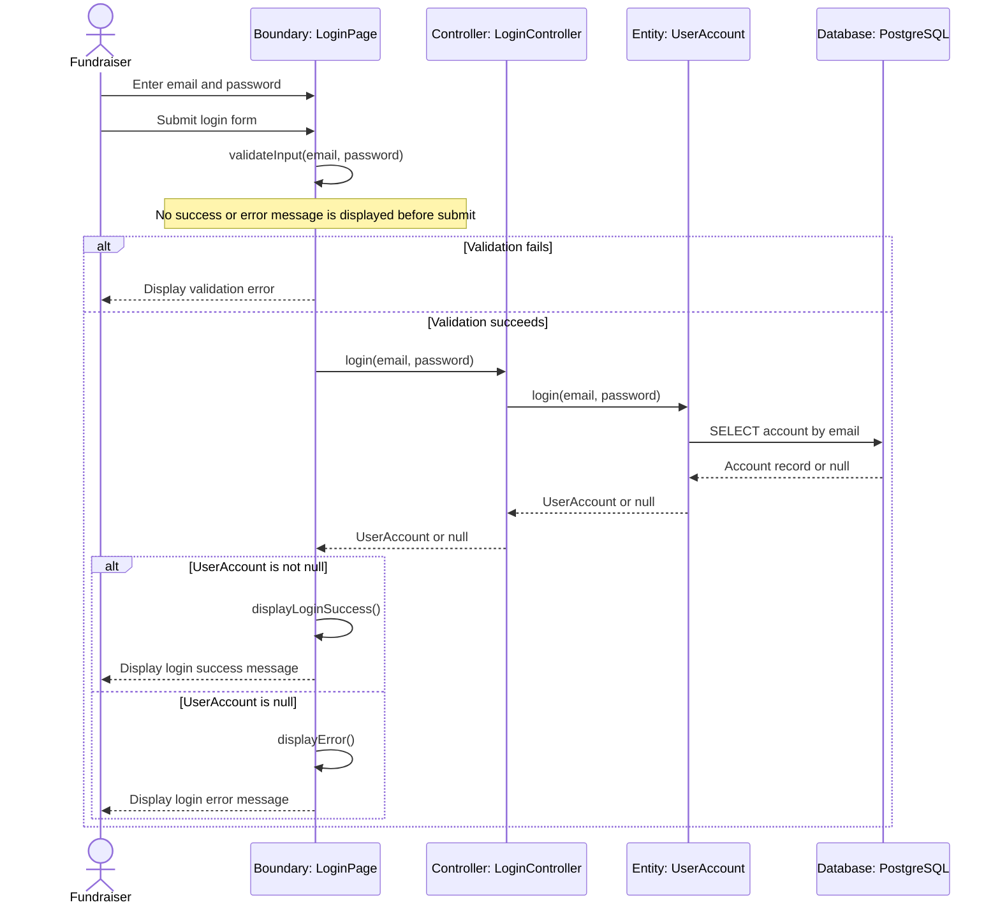

# Sequence Diagram: Fundraiser Login

```mermaid
sequenceDiagram
    actor Fundraiser
    participant LoginPage as Boundary: LoginPage
    participant LoginController as Controller: LoginController
    participant UserAccount as Entity: UserAccount
    participant PostgreSQL as Database: PostgreSQL

    Fundraiser->>LoginPage: Enter email and password
    Fundraiser->>LoginPage: Submit login form
    LoginPage->>LoginPage: validateInput(email, password)
    Note over LoginPage: No success or error message is displayed before submit

    alt Validation fails
        LoginPage-->>Fundraiser: Display validation error
    else Validation succeeds
        LoginPage->>LoginController: login(email, password)
        LoginController->>UserAccount: login(email, password)
        UserAccount->>PostgreSQL: SELECT account by email
        PostgreSQL-->>UserAccount: Account record or null
        UserAccount-->>LoginController: UserAccount or null
        LoginController-->>LoginPage: UserAccount or null

        alt UserAccount is not null
            LoginPage->>LoginPage: displayLoginSuccess()
            LoginPage-->>Fundraiser: Display login success message
        else UserAccount is null
            LoginPage->>LoginPage: displayError()
            LoginPage-->>Fundraiser: Display login error message
        end
    end
```
