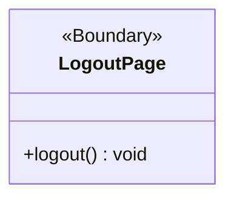

# BCE Diagram: Profile Logout

## BCE Role Mapping
- Actor: Any logged-in profile type can initiate logout.
- Boundary: `LogoutPage` is the logout boundary used by any logged-in profile type to end the current login state and return to the login page.
- Controller: No controller is shown in the current logout design artifact.
- Entity: No entity is shown in the current logout design artifact.
- Database: No direct database interaction is shown in the current logout design artifact.
- Shared actor rule: The same `LogoutPage.logout()` flow applies to every logged-in profile type.

## Design Notes
- The class diagram follows the provided logout diagram where `LogoutPage` exposes `logout(): void`.
- The implemented boundary helper file is `frontend/src/feature/logout/boundary/LogoutPage.ts`.
- Logout is a boundary-only operation in this design because the current implementation stores login state in the browser and has no server-side session invalidation.
