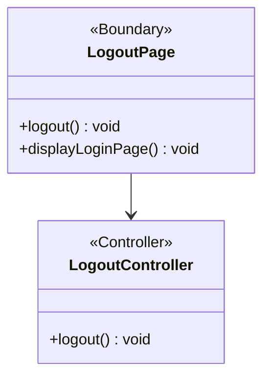

# BCE Diagram: Multi-Actor Logout

## BCE Role Mapping
- Boundary: `LogoutPage` is the logout boundary used by `Fundraiser`, `Donee`, `User admin`, and `Platform manager` to initiate logout and return to the login page.
- Controller: `LogoutController` coordinates the logout use case after receiving the request from `LogoutPage`.
- Entity: No entity is shown in the current logout design artifact because the provided logout flow is boundary-controller focused.
- Database: No direct database interaction is shown in the current logout design artifact.
- Shared actor rule: The same `LogoutPage` and `LogoutController` flow applies to `Fundraiser`, `Donee`, `User admin`, and `Platform manager`.
