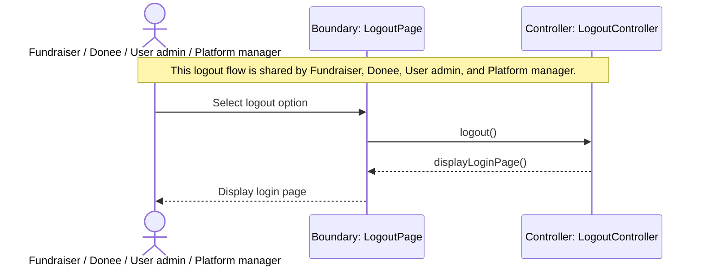

# Sequence Diagram: Multi-Actor Logout

```mermaid
sequenceDiagram
    actor User as Fundraiser / Donee / User admin / Platform manager
    participant LogoutPage as Boundary: LogoutPage
    participant LogoutController as Controller: LogoutController

    Note over User,LogoutController: This logout flow is shared by Fundraiser, Donee, User admin, and Platform manager.

    User->>LogoutPage: Select logout option
    LogoutPage->>LogoutController: logout()
    LogoutController-->>LogoutPage: displayLoginPage()
    LogoutPage-->>User: Display login page
```
