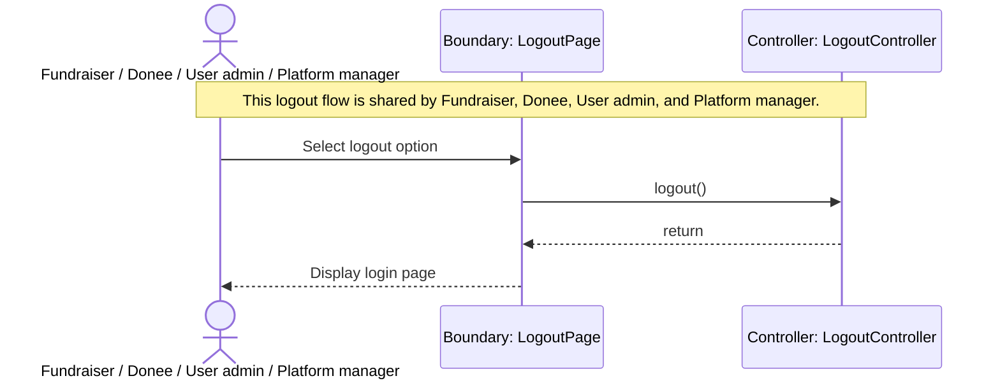

# Sequence Diagram: Multi-Actor Logout

## Design Notes
- The implemented boundary helper lives at `frontend/src/feature/logout/boundary/LogoutPage.ts`.
- `LogoutController.logout()` is modeled as `void` in code to match the current class diagram; the HTTP route always returns `{ success: true }` after invoking the controller.
- `displayLoginPage()` remains a boundary-side transition that clears local UI state after the logout request completes.
