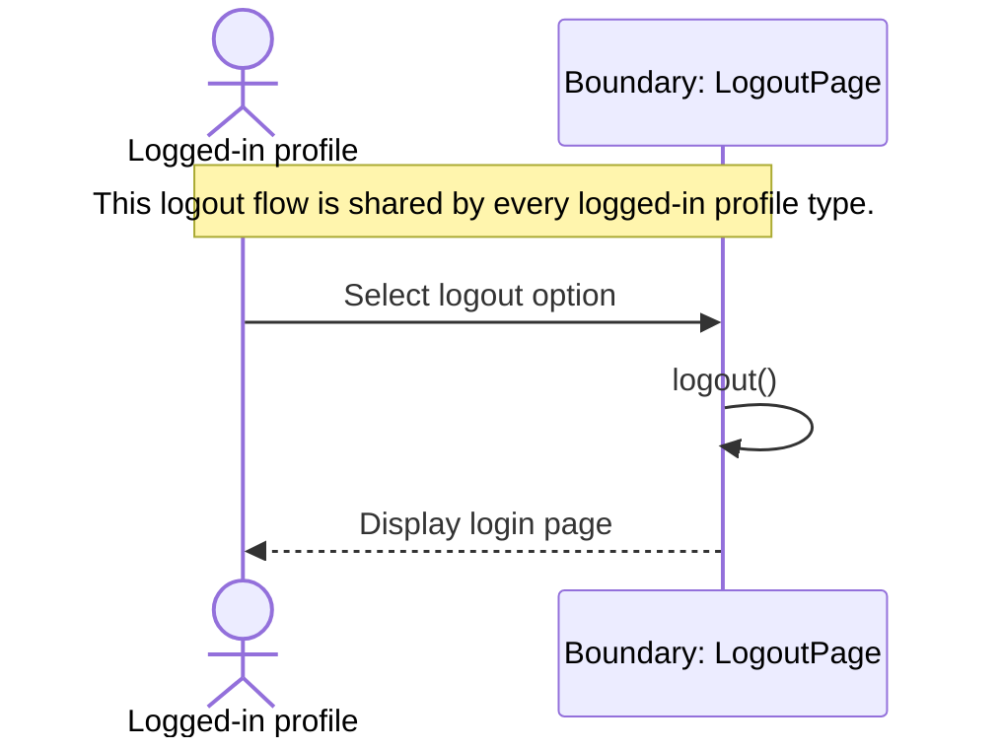

# Sequence Diagram: Profile Logout

## Design Notes
- The implemented boundary helper lives at `frontend/src/feature/logout/boundary/LogoutPage.ts`.
- `LogoutPage.logout()` is modeled as `void` in code to match the current class diagram.
- No backend route, controller, entity, or database call participates in the current logout sequence.
