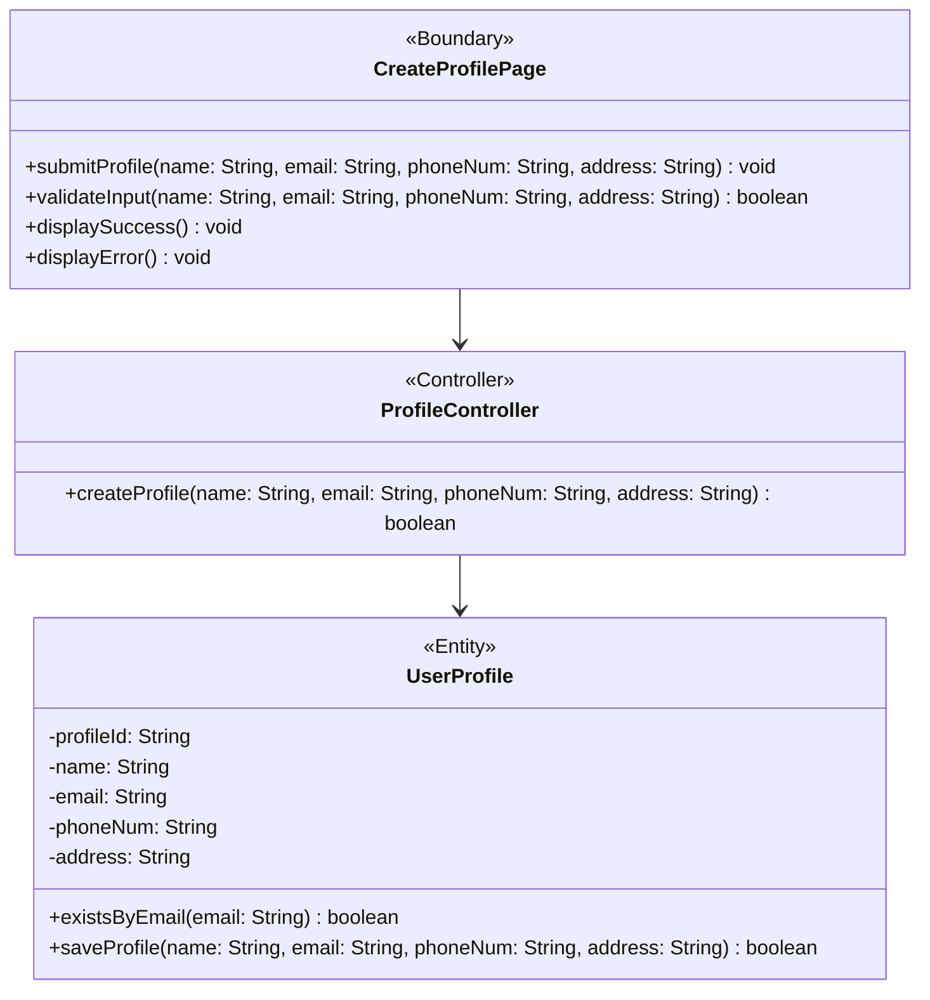

# BCE Diagram: Create User Profile

## BCE Role Mapping
- Boundary: Next.js create profile page component at `frontend/src/feature/profile/boundary/CreateProfilePage.tsx` that gathers input, validates user input, and shows success or error feedback.
- Controller: TypeScript profile controller class at `backend/src/profile/controller/ProfileController.ts` that coordinates the create profile use case.
- Entity: TypeScript user profile entity class at `backend/src/profile/entity/UserProfile.ts` that represents persisted profile data and handles email uniqueness checks and profile saving.
- Database: PostgreSQL `user_profile` table used by the entity layer.
- Boundary rule: No success or error message is displayed before the user admin submits the create profile form.
