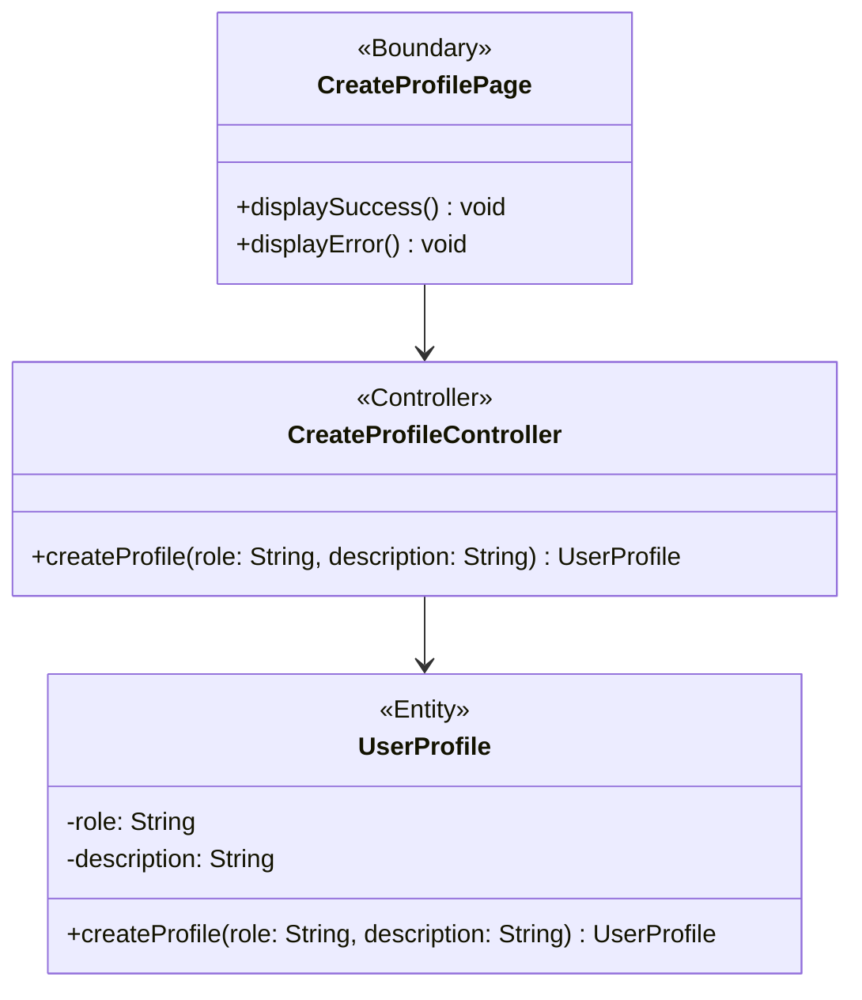

# BCE Diagram: Create User Profile

## BCE Role Mapping
- Boundary: Next.js create profile page component at `frontend/src/feature/CreateProfile/boundary/CreateProfilePage.tsx` that gathers role and description, validates input, and shows success or error feedback.
- HTTP API route: Express route adapter at `backend/src/routes/CreateProfileRoutes.ts` that maps the HTTP request to the controller and returns `UserProfile` or `null`.
- Controller: TypeScript create profile controller class at `backend/src/CreateProfile/controller/CreateProfileController.ts` that coordinates the create profile use case.
- Entity: TypeScript user profile entity class at `backend/src/CreateProfile/entity/UserProfile.ts` that represents persisted profile data and handles the insert.
- Database: PostgreSQL `user_profile` table used by the entity layer.
- Boundary rule: No success or error message is displayed before the User Admin submits the create profile form.
