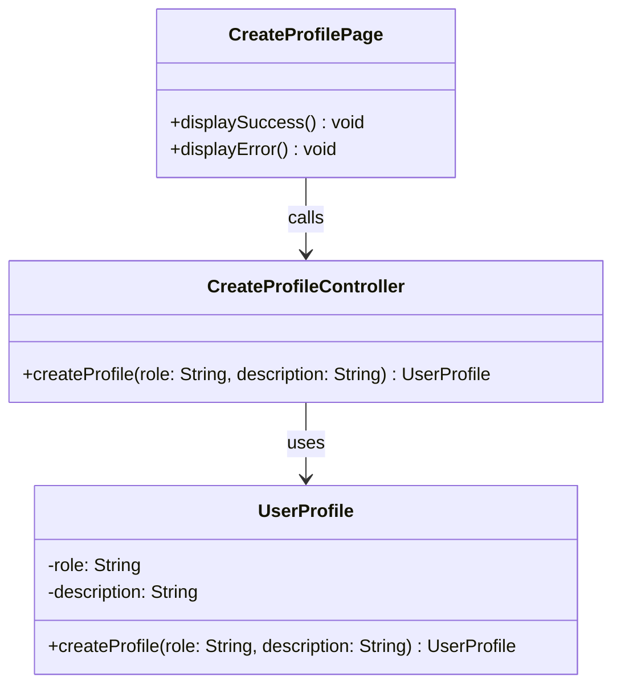

# Class Diagram: Create User Profile

## Design Notes
- `role` and `description` are the only profile inputs in the CreateProfile flow.
- `CreateProfileController.createProfile(role, description)` returns a `UserProfile` on success or `null` when creation fails.
- `UserProfile.createProfile(role, description)` owns the PostgreSQL insert into `user_profile`.
- Runtime code wraps return types in `Promise<T>` because database operations are async.
- The implemented boundary component lives at `frontend/src/feature/CreateProfile/boundary/CreateProfilePage.tsx`.
