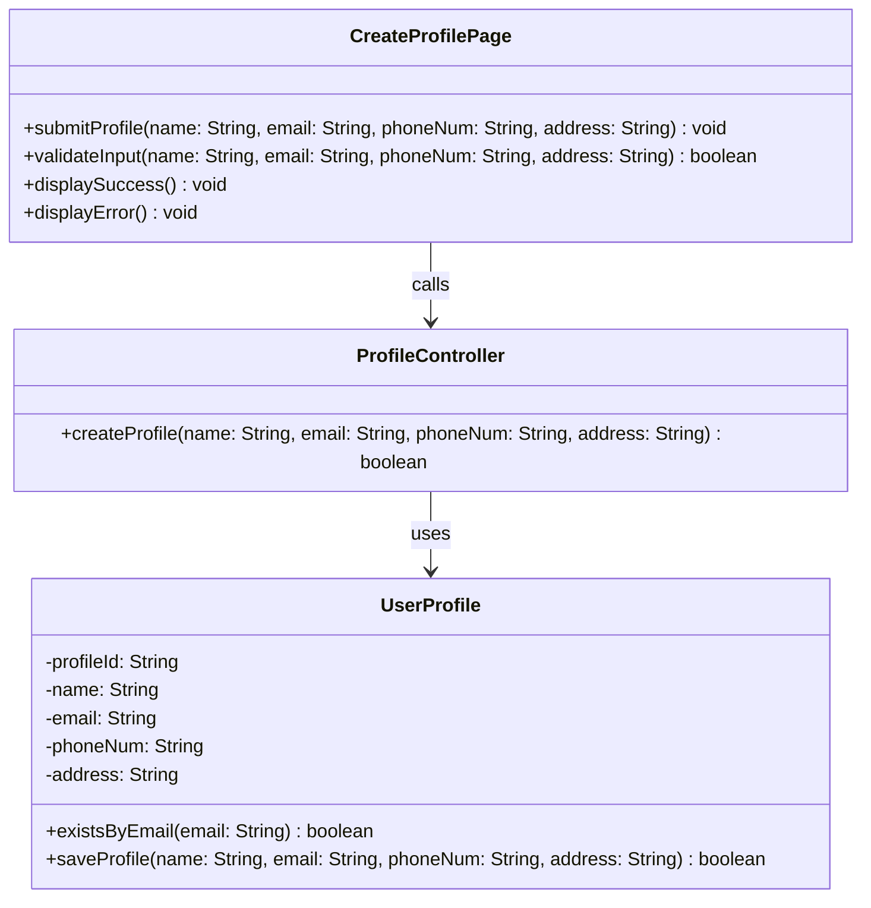

# Class Diagram: Create User Profile

## Design Notes
- `profileId` is generated by PostgreSQL as `BIGSERIAL` and converted to `String` in the entity constructor. The create flow does not require the caller to supply a profile ID.
- `existsByEmail` and `saveProfile` are static methods on the `UserProfile` entity class, following the BCE pattern where the Entity owns all DB access via `pg` raw SQL.
- `ProfileController.createProfile(name, email, phoneNum, address)` returns a result object containing `success: boolean` and `message: string` so the boundary and route can distinguish between "Email already exists." and "Failed to create profile." error cases. The `success` field serves as the `boolean` return type specified in the diagram.
- Return types in code are `Promise<T>` due to async DB operations. The underlying type still matches the diagram intent.
- `displayError()` accepts an optional message parameter internally to display specific validation and backend error messages, while the diagram captures the public contract.
- The implemented boundary component lives at `frontend/src/feature/profile/boundary/CreateProfilePage.tsx`.
