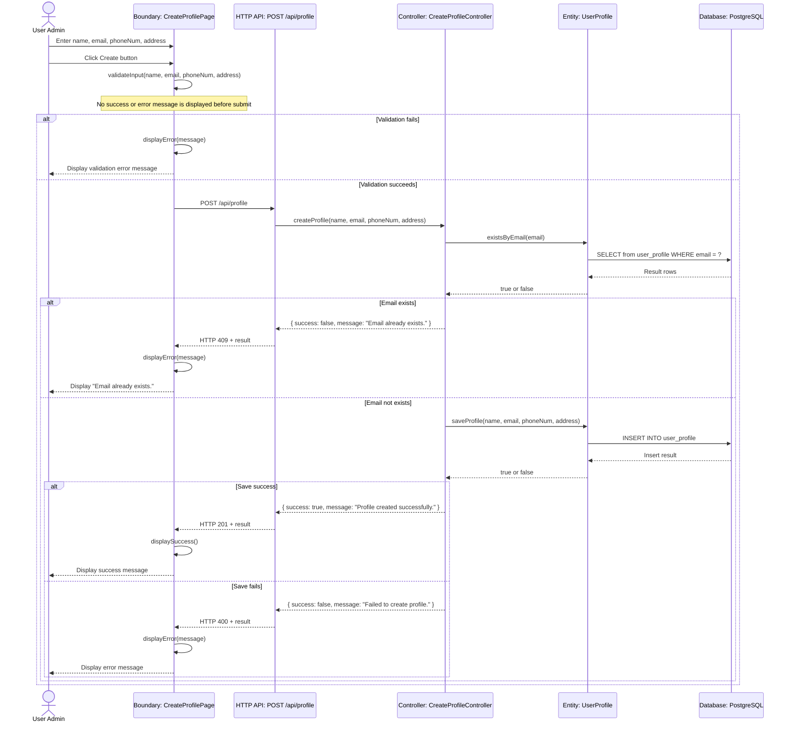

# Sequence Diagram: Create User Profile

```mermaid
sequenceDiagram
    actor UserAdmin as User Admin
    participant CreateProfilePage as Boundary: CreateProfilePage
    participant ProfileRoute as HTTP API: POST /api/profile
    participant CreateProfileController as Controller: CreateProfileController
    participant UserProfile as Entity: UserProfile
    participant PostgreSQL as Database: PostgreSQL

    UserAdmin->>CreateProfilePage: Enter name, email, phoneNum, address
    UserAdmin->>CreateProfilePage: Click Create button
    CreateProfilePage->>CreateProfilePage: validateInput(name, email, phoneNum, address)
    Note over CreateProfilePage: No success or error message is displayed before submit

    alt Validation fails
        CreateProfilePage->>CreateProfilePage: displayError(message)
        CreateProfilePage-->>UserAdmin: Display validation error message
    else Validation succeeds
        CreateProfilePage->>ProfileRoute: POST /api/profile
        ProfileRoute->>CreateProfileController: createProfile(name, email, phoneNum, address)
        CreateProfileController->>UserProfile: existsByEmail(email)
        UserProfile->>PostgreSQL: SELECT from user_profile WHERE email = ?
        PostgreSQL-->>UserProfile: Result rows
        UserProfile-->>CreateProfileController: true or false

        alt Email exists
            CreateProfileController-->>ProfileRoute: { success: false, message: "Email already exists." }
            ProfileRoute-->>CreateProfilePage: HTTP 409 + result
            CreateProfilePage->>CreateProfilePage: displayError(message)
            CreateProfilePage-->>UserAdmin: Display "Email already exists."
        else Email not exists
            CreateProfileController->>UserProfile: saveProfile(name, email, phoneNum, address)
            UserProfile->>PostgreSQL: INSERT INTO user_profile
            PostgreSQL-->>UserProfile: Insert result
            UserProfile-->>CreateProfileController: true or false

            alt Save success
                CreateProfileController-->>ProfileRoute: { success: true, message: "Profile created successfully." }
                ProfileRoute-->>CreateProfilePage: HTTP 201 + result
                CreateProfilePage->>CreateProfilePage: displaySuccess()
                CreateProfilePage-->>UserAdmin: Display success message
            else Save fails
                CreateProfileController-->>ProfileRoute: { success: false, message: "Failed to create profile." }
                ProfileRoute-->>CreateProfilePage: HTTP 400 + result
                CreateProfilePage->>CreateProfilePage: displayError(message)
                CreateProfilePage-->>UserAdmin: Display error message
            end
        end
    end
```
